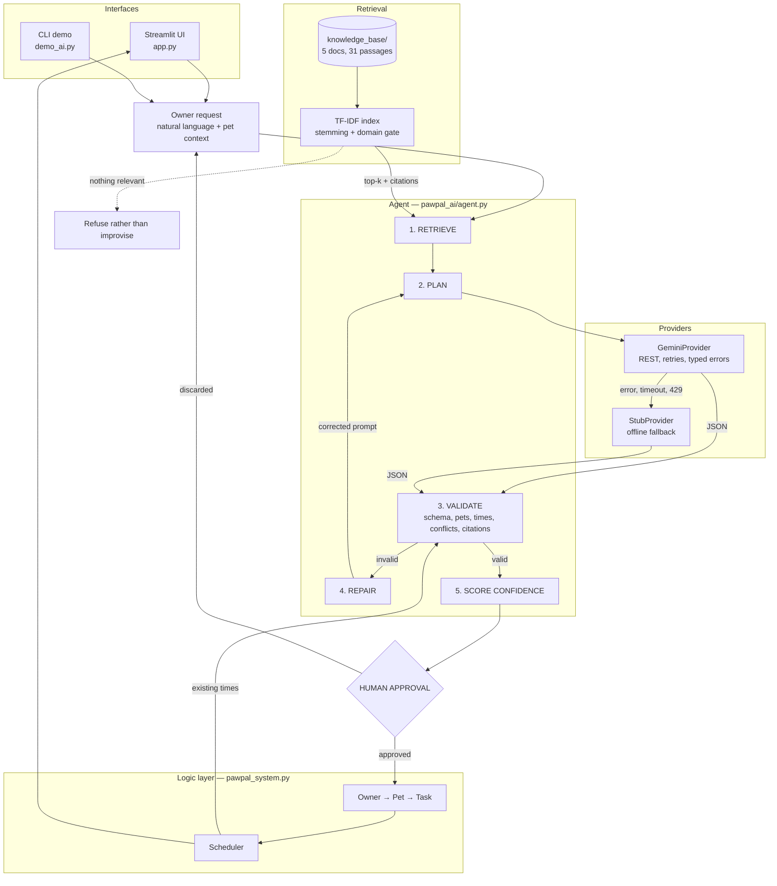

# PawPal+ — A Grounded, Self-Checking Pet-Care Planning Agent

PawPal+ turns a sentence like *"Biscuit is a 9-month-old puppy and I work 9 to 5"* into a
concrete daily care schedule — grounded in a local pet-care knowledge base, validated
against the rules of the existing scheduler, repaired by the model when it gets those rules
wrong, and held for human approval before anything is committed.

The interesting part is not that it calls a language model. It is what happens to the
model's output afterwards: **every plan is treated as untrusted input** and has to survive
a validator before a person is even shown the Approve button.

---

## The base project this evolves

**Original project: PawPal+ (Modules 1–3).** A Streamlit pet-care planner built around four
classes — `Owner` → `Pet` → `Task`, with a `Scheduler` holding all cross-pet logic. It let
an owner add pets, schedule care tasks at fixed times, and view a day sorted
chronologically with per-pet and per-status filters. Its "smart" behaviour was
deterministic: time sorting, filtering, daily/weekly recurrence, and warnings when two
tasks were booked at the same minute.

Everything above still runs, unchanged. [`pawpal_system.py`](pawpal_system.py) was not
modified for this project — the AI layer sits on top of it and feeds it validated `Task`
objects through the same `Pet.add_task()` the UI has always used.

**What Module 4 adds:** retrieval-augmented generation over a pet-care corpus, an agentic
plan → validate → repair loop, a provider-agnostic model client with an offline fallback,
confidence scoring, structured run traces, and an evaluation harness.

---

## Architecture

Source: [`diagrams/architecture.mmd`](diagrams/architecture.mmd)



Read it as one loop. A request is **grounded** before it is answered, **checked** after it
is answered, **repaired** if the check fails, and **gated** behind a human before it can
change anything.

Four components carry the weight:

**Retriever** ([`pawpal_ai/retriever.py`](pawpal_ai/retriever.py)) — splits the corpus on
Markdown `##` headings, indexes it with TF-IDF, and returns the top 3 passages with
citation labels. If fewer than half the query's words appear in the corpus at all, it
returns nothing, and the agent says so instead of guessing.

**Providers** ([`pawpal_ai/providers.py`](pawpal_ai/providers.py)) — the agent talks to an
`LLMProvider` interface, never a vendor SDK. `GeminiProvider` calls the REST endpoint with
bounded retries and typed errors. `StubProvider` is a deterministic offline planner that
doubles as the fallback, so the degraded path is exercised on every test run.

**Validator** ([`pawpal_ai/schemas.py`](pawpal_ai/schemas.py)) — the guardrail. Checks pets
against the real roster, enforces zero-padded `HH:MM`, rejects citations that were never
retrieved, and detects conflicts against both the live schedule and the plan's own tasks.

**Agent** ([`pawpal_ai/agent.py`](pawpal_ai/agent.py)) — runs the loop and records every
step to a trace. `plan()` returns a proposal; `commit()` applies it. Those are separate on
purpose.

---

## Setup

Requires **Python 3.9+**. No paid account is needed — the Gemini free tier requires no
credit card, and the system runs offline without any key at all.

```bash
git clone https://github.com/Lakshya751/applied-ai-system-project.git
cd applied-ai-system-project

python3 -m venv .venv
source .venv/bin/activate          # Windows: .venv\Scripts\activate
pip install -r requirements.txt
```

**Add a model (optional but recommended).** Get a free key at
[aistudio.google.com](https://aistudio.google.com) — no credit card:

```bash
cp .env.example .env
# paste your key into GEMINI_API_KEY=
```

**Verify the install before relying on it:**

```bash
python check_setup.py
```

This checks dependencies, indexes the corpus, confirms your key works, and — if the model
ID in `.env` is wrong — prints the list of models your key *can* reach, which is the
failure people actually hit. Worth knowing: the `gemini-2.x` models still *authenticate*
and still appear in the model list, but return `429` with `limit: 0` because they are
retired from the free tier. The default is `gemini-3.6-flash`.

```
Knowledge base
  [PASS] 31 passages from 5 documents
  [PASS] Sample query resolved to puppy_and_kitten_care.md#kitten-feeding (0.44)
  [PASS] Off-topic query correctly rejected
```

**Run it:**

```bash
streamlit run app.py     # the web app
python demo_ai.py        # scripted walkthrough of all three scenarios
python evaluate.py       # the evaluation harness
python -m pytest         # the test suite
```

Without a key everything still runs, clearly labelled as offline. Force that mode with
`PAWPAL_PROVIDER=stub`.

---

## Sample interactions

Captured against the live model (`gemini-3.6-flash`, free tier). Full transcript:
[`docs/sample_run.md`](docs/sample_run.md). Reproduce with `python demo_ai.py`.

### Example 1 — Plan a day, then approve it

**Input:** two pets, one appointment already booked at 11:00.

```text
Request: Biscuit is a 9-month-old puppy and Mochi is an adult indoor cat.
I work 09:00 to 17:00 on weekdays. Plan a realistic daily routine that
doesn't leave Biscuit alone too long.

  Summary: This plan structures daily feeding and exercise routines around your
  09:00 to 17:00 work schedule. Biscuit receives twice-daily meals and walks
  suited for a 9-month-old, while Mochi is fed in parallel morning and evening.
  The plan avoids conflict with the scheduled 11:00 vet checkup.

  Confidence: 0.85   Repairs: 0   Mode: live model

  Proposed tasks (awaiting approval):
    07:30  Morning walk and toilet break    Biscuit    [daily]
            why: Provides morning exercise and a toilet break before the work day begins.
            source: puppy_and_kitten_care.md#puppy-exercise-limits,
                    puppy_and_kitten_care.md#puppy-toileting-frequency
    08:00  Morning meal                     Biscuit    [daily]
            why: Provides the first of two daily meals appropriate for a 9-month-old dog.
            source: puppy_and_kitten_care.md#puppy-feeding
    08:15  Morning meal and fresh water     Mochi      [daily]
            why: Ensures Mochi is fed and has fresh water before work hours.
    17:30  Evening walk and toilet break    Biscuit    [daily]
            why: Gives Biscuit exercise and relief immediately following your workday.
            source: puppy_and_kitten_care.md#puppy-exercise-limits,
                    puppy_and_kitten_care.md#puppy-toileting-frequency
    18:00  Evening meal                     Biscuit    [daily]
            why: Provides the second daily meal for Biscuit.
            source: puppy_and_kitten_care.md#puppy-feeding
    18:30  Evening meal and play session    Mochi      [daily]
            why: Provides Mochi's evening food and indoor enrichment.

  Caveats:
    - Verify whether a mid-day dog walker or drop-in visit is needed for Biscuit
      while you are at work from 09:00 to 17:00.
    - Consult your vet during the 11:00 checkup regarding exact daily caloric
      needs and exercise tolerances as growth plates continue closing.

  Agent trace:
    [start] Planning for Jordan with 2 pet(s)
    [retrieve] 3 passage(s) retrieved
    [model] gemini:gemini-3.6-flash replied in 6410ms
    [validate] 6 task(s) accepted, 0 issue(s)
    [propose] 6 task(s) proposed for approval (confidence 0.85, repairs 0)

  >>> Human approved. 6 task(s) committed.

Today's Schedule:
  07:30  Morning walk and toilet break (Biscuit) [daily] [todo]
  08:00  Morning meal (Biscuit) [daily] [todo]
  08:15  Morning meal and fresh water (Mochi) [daily] [todo]
  11:00  Vet checkup (Biscuit) [once] [todo]
  17:30  Evening walk and toilet break (Biscuit) [daily] [todo]
  18:00  Evening meal (Biscuit) [daily] [todo]
  18:30  Evening meal and play session (Mochi) [daily] [todo]
```

Three things worth noticing. The plan **routed around the pre-existing 11:00 appointment**.
It cited the specific passages it relied on, and every citation was checked against what
was actually retrieved. And rather than inventing a midday walk it could not guarantee, it
raised the gap as a **caveat** — the owner is at work from 09:00 to 17:00, which is longer
than the corpus says a 9-month-old should be left.

On another run the model instead scheduled an explicit `13:00 Midday toilet break and
check-in`, citing `puppy-toileting-frequency`. Same constraint, two defensible answers —
temperature is 0.2, not 0, so runs vary.

### Example 2 — The self-repair loop

The validator rejecting bad model output and the model correcting it. Produced by
injecting three scripted responses through the provider interface — a real model will not
emit exactly the failure you want on demand. Reproduce with the snippet in
[`ai_interactions.md`](ai_interactions.md).

```text
[start]    Planning for Jordan with 1 pet(s)
[retrieve] 3 passage(s) retrieved for query 'Plan a morning walk for Biscuit. dog'
[model]    scripted:scripted-v1 replied in 1ms
[validate] 0 task(s) accepted, 1 issue(s)      <- pet "Rex" doesn't exist, time "8am"
[repair]   Attempt 1 rejected; asking the model to fix 1 issue(s)
[model]    scripted:scripted-v1 replied in 1ms
[validate] 0 task(s) accepted, 1 issue(s)      <- 11:00 collides with the vet checkup
[repair]   Attempt 2 rejected; asking the model to fix 1 issue(s)
[model]    scripted:scripted-v1 replied in 1ms
[validate] 1 task(s) accepted, 0 issue(s)
[propose]  1 task(s) proposed for approval (confidence 0.54, repairs 2)

final: ok=True repairs=2 confidence=0.54 time=07:30
```

Confidence fell from the model's self-reported 0.90 to 0.54 — two repairs at 20% each,
plus a discount for citing nothing.

### Example 3 — Guardrails: refusing instead of improvising

```text
3a. Out-of-domain question
    Q: How do I fix my car engine?

    A: I don't have guidance on that in my knowledge base, so I'd rather not
       guess. The knowledge base covers dog and cat routines, puppy and kitten
       care, senior pets, and medication timing. For anything medical, please
       ask your vet.
    Confidence: 0.00

3b. Planning with no pets registered
    -> No pets registered. Add a pet before asking for a plan.

3c. Empty request
    -> Empty request. Describe what you want scheduled.
```

The refusal is retrieval-driven, not a keyword blocklist: nothing cleared the domain gate,
so there was no grounding, so the agent declines.

### Example 4 — Grounded answers, including one honest failure

Both of these are live output. The first is what the system does well; the second is a real
limitation I chose to leave visible rather than tune around.

```text
Q: How often should I brush a long-haired cat?

A: Long-haired cats, such as Persians and Maine Coons, need daily brushing to
   prevent painful matting [cat_care.md#grooming].

   Sources: cat_care.md#grooming, ...
   Confidence: 1.00

Q: My cat keeps waking me up at 4am. What can I change?

A: I am sorry, but the provided guidance does not cover information on how to
   address a cat waking you up early in the morning or changes to make for
   early-morning behavior.

   If this is a new or sudden change in your cat's behavior, please contact a
   veterinarian to rule out any underlying medical conditions or discomfort.

   Sources: cat_care.md#litter-tray, cat_care.md#water, cat_care.md#grooming
   Confidence: 0.49
```

The corpus **does** answer the second question — `cat_care.md#play-and-enrichment` explains
that cats are crepuscular and that an evening play session reduces night-time waking. The
retriever simply failed to surface it, because `4am` tokenizes to `am` and the query shares
almost no vocabulary with the passage. The model then did the right thing with what it was
given: it declined instead of inventing an answer, and it escalated to a vet.

That is the behaviour I wanted at the boundary — a grounded system that fails closed. The
retrieval weakness behind it is analysed in [`ai_interactions.md`](ai_interactions.md).

---

## Design decisions and trade-offs

**The AI proposes; a human commits.** `plan()` never mutates the schedule — a test asserts
this. An assistant that silently rewrites a pet's medication schedule is a worse product
than one that asks. The cost is an extra click.

**REST instead of the official SDK.** `google-genai` requires Python ≥ 3.10 (my default
`python3` is 3.9.6), and Google's own docs currently disagree about its call signature. The
documented REST endpoint needs only `requests`, works on any Python 3.9+, and is insulated
from SDK churn. Cost: I maintain the HTTP and error handling myself.

**TF-IDF instead of embeddings.** Retrieval stays free, offline, deterministic and
unit-testable, with zero heavy dependencies. The cost is real and measured: lexical
matching misses paraphrases — *"waking me up at 4am"* fails where *"waking me at night"*
succeeds. Documented in [`model_card.md`](model_card.md) rather than hidden.

**The fallback is the stub provider, not separate emergency code.** When the API fails, the
agent degrades to the same deterministic planner the tests use. Emergency paths that only
run in emergencies are the ones that are broken when you need them.

**Validation feeds back rather than fails.** A rejected plan becomes a correction prompt
containing the exact validator messages. The repair budget is bounded (default 2), so bad
output cannot loop forever — and the harness proves it stops (`test_agent_gives_up_after_the_repair_budget`).

**Citations are whitelisted against what was actually retrieved.** The specific RAG failure
worth preventing is invented sources, which make output *look* better-grounded than it is.

**Zero-padded `HH:MM` is enforced, not requested.** `Scheduler.sort_by_time()` sorts times
as plain strings, so `"8:00"` would silently sort *after* `"18:00"`. The validator protects
an invariant the original Module 1–3 code already depended on.

**Confidence is deliberately pessimistic.** The model's self-report is discounted for
repairs, missing grounding, and degraded mode. It is a comparative signal, not a
probability.

---

## Testing summary

**62/62 unit tests pass** (`python -m pytest`) — 12 inherited from Modules 1–3, 50 new.
**25/25 evaluation cases pass** (`python evaluate.py`) against the live model *and* against
the offline baseline. Machine-readable results in [`evaluation/results.md`](evaluation/results.md).

| Suite | Cases | What it proves |
|---|---|---|
| Retrieval | 12 | The right document surfaces in the top-3, **and** out-of-domain queries return nothing |
| Validation | 10 | Each guardrail rejects its specific failure category, checked by issue kind |
| Planning | 3 | The full loop yields valid times, real pets, and a conflict-free schedule |

| Run | Cases passed | Mean confidence |
|---|---|---|
| Live (`gemini-3.6-flash`) | 25/25 | 0.50 |
| Offline baseline (`PAWPAL_PROVIDER=stub`) | 25/25 | 0.36 |

**What worked.** Defensive JSON parsing was easier than expected — fences, prose wrappers
and JSON mode are handled in about thirty lines. The validate/repair loop behaves exactly
as designed under fault injection, including giving up cleanly when output stays bad. Once
live, the model handled the constraint properly: given a 09:00–17:00 workday it either
scheduled a midday check-in or flagged the gap as a caveat, rather than silently producing
a schedule that left a puppy alone for eight hours.

**What didn't — and what only the live model revealed.** The first live run failed
completely: *"No valid tasks survived validation"*, three times in a row, reported as
malformed JSON. It was not malformed. Gemini 3.x is a thinking model that spends output
tokens on hidden reasoning — ~850 of my 2048-token budget — so the plan was **truncated
mid-object**. Every offline test passed throughout, because fake providers never exhaust a
token budget. Fixed by raising the budget, setting `thinkingLevel: low`, and — the part
that actually mattered — detecting `finishReason: MAX_TOKENS` and reporting truncation *as
truncation*, so the trace stops blaming the parser. There is now a regression test for it.

Retrieval ranking remains the weak point. Three phrasings of "my cat wakes me at night"
produce three different top results, one missing the correct passage entirely (Example 4
above). Separately, my own verb-stemming fix caused a regression — the corpus phrase *"a
**fixed** daily event"* stems to `fix`, so *"fix my car engine"* began retrieving
medication guidance — which is why a query-coverage domain gate and permanent out-of-domain
eval cases now exist.

**What I'd measure next.** The offline fallback also scores 25/25, which is a warning
rather than a win: the planning cases check *internal consistency*, and fixed routines are
trivially consistent while ignoring the request entirely. Confidence separates them (0.50
vs 0.36) but that is a self-report, not a measurement. The honest next metric is whether
the live model's plans beat that baseline on *relevance to the owner's stated constraints*
— which needs human scoring, not assertions.

---

## Reflection

The most useful thing I learned is that in an AI system, the model is the easy part.
Wiring up Gemini took an afternoon. What took real work was everything defending against
it: deciding what "wrong" means precisely enough to check automatically, making failure
visible instead of plausible, and choosing where a human has to stay in the loop.

The second lesson was that quality has to be measured. My retrieval bug never threw an
exception — it just quietly returned senior-dog advice for a puppy question. It surfaced
only because I printed real scores for realistic queries. Building `evaluate.py` early
changed how I worked: every tuning change afterwards was a hypothesis with a number
attached, and one of them turned out to be a regression I would otherwise have shipped.

My full responsible-AI reflection — limitations and biases, misuse risks, what surprised me,
and where my AI assistant helped and where it was confidently wrong — is in
**[`model_card.md`](model_card.md)**.

---

## Project structure

```
pawpal_system.py        Logic layer from Modules 1-3 — unchanged
app.py                  Streamlit UI: manual scheduling + AI planner + grounded Q&A
main.py                 Original CLI demo of the deterministic scheduler
demo_ai.py              Three-scenario walkthrough of the AI layer
check_setup.py          Verifies deps, corpus and model reachability
evaluate.py             Evaluation harness -> evaluation/results.md

pawpal_ai/
  config.py             Settings, .env loading, no hard-coded secrets
  logging_setup.py      Logging + RunTrace (auditable per-run records)
  retriever.py          TF-IDF retrieval, stemming, domain gate
  providers.py          LLMProvider interface, Gemini REST client, offline stub
  schemas.py            Plan parsing and every validation rule
  agent.py              retrieve -> plan -> validate -> repair -> propose

knowledge_base/         5 Markdown documents, 31 retrievable passages
diagrams/               architecture.mmd (this system) + UML from Modules 1-3
evaluation/             eval_cases.json + generated results.md
docs/sample_run.md      Verbatim reproducible command output
tests/                  62 tests
model_card.md           Reflection, limitations, biases, misuse analysis
ai_interactions.md      Agent reasoning traces + retrieval tuning experiments
```
